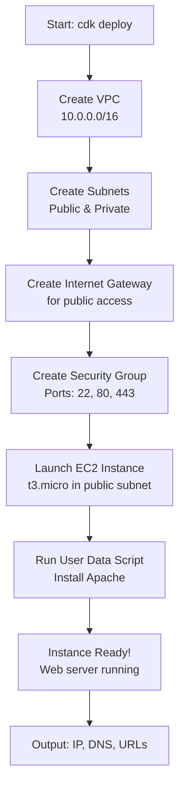

# EC2 Stack - Complete Step-by-Step Explanation

This document explains every line of code in `ec2_stack.py` to help you understand how AWS CDK creates an EC2 instance with VPC and security groups.

## Table of Contents
1. [Imports and Dependencies](#imports-and-dependencies)
2. [Class Definition](#class-definition)
3. [VPC Creation](#vpc-creation)
4. [Security Group Configuration](#security-group-configuration)
5. [EC2 Instance Setup](#ec2-instance-setup)
6. [User Data Script](#user-data-script)
7. [Tags and Outputs](#tags-and-outputs)

---

## Imports and Dependencies

```python
from aws_cdk import (
    Stack,
    aws_ec2 as ec2,
    CfnOutput,
    Tags
)
from constructs import Construct
```

### What This Does:
- **`Stack`**: Base class for creating a CloudFormation stack. Every CDK stack inherits from this.
- **`aws_ec2 as ec2`**: Imports EC2-related constructs (VPC, Instance, SecurityGroup, etc.) and aliases it as `ec2` for easier use.
- **`CfnOutput`**: Creates CloudFormation outputs that display information after deployment (like IP addresses, URLs).
- **`Tags`**: Allows you to add metadata tags to AWS resources for organization and cost tracking.
- **`Construct`**: Base class from the constructs library - all CDK components are constructs.

---

## Class Definition

```python
class EC2Stack(Stack):
    """
    CDK Stack that creates an EC2 instance with VPC and security groups.
    
    This stack includes:
    - VPC with public and private subnets across 2 AZs
    - Internet Gateway for public subnet access
    - Security Group allowing SSH and HTTP access
    - EC2 instance in the public subnet
    - User data script for initial configuration
    """
```

### What This Does:
- **`class EC2Stack(Stack)`**: Creates a new class called `EC2Stack` that inherits from `Stack`.
- **Docstring**: Python documentation explaining what this stack creates.

```python
    def __init__(self, scope: Construct, construct_id: str, **kwargs) -> None:
        super().__init__(scope, construct_id, **kwargs)
```

### What This Does:
- **`__init__`**: Constructor method that runs when you create an instance of this class.
- **`scope`**: Parent construct (usually the CDK App).
- **`construct_id`**: Unique identifier for this stack (e.g., "EC2Stack").
- **`**kwargs`**: Additional arguments like AWS region, account, etc.
- **`super().__init__(...)`**: Calls the parent Stack class constructor to initialize the stack properly.

---

## VPC Creation

```python
        vpc = ec2.Vpc(
            self, "EC2-VPC",
            vpc_name="ec2-demo-vpc",
            ip_addresses=ec2.IpAddresses.cidr("10.0.0.0/16"),
            max_azs=2,
            nat_gateways=0,
            subnet_configuration=[
                ec2.SubnetConfiguration(
                    name="Public",
                    subnet_type=ec2.SubnetType.PUBLIC,
                    cidr_mask=24
                ),
                ec2.SubnetConfiguration(
                    name="Private",
                    subnet_type=ec2.SubnetType.PRIVATE_ISOLATED,
                    cidr_mask=24
                )
            ]
        )
```

### Line-by-Line Breakdown:

**`vpc = ec2.Vpc(`**
- Creates a new VPC (Virtual Private Cloud) - your isolated network in AWS.

**`self, "EC2-VPC",`**
- `self`: Adds this VPC to the current stack.
- `"EC2-VPC"`: Logical ID for this construct (used internally by CDK).

**`vpc_name="ec2-demo-vpc",`**
- The actual name tag that appears in AWS Console.

**`ip_addresses=ec2.IpAddresses.cidr("10.0.0.0/16"),`**
- **CIDR block**: Defines the IP address range for your VPC.
- `10.0.0.0/16` means: 
  - Network: 10.0.0.0
  - Can have 65,536 IP addresses (10.0.0.0 to 10.0.255.255)
  - `/16` means first 16 bits are fixed (10.0), last 16 bits are variable

**`max_azs=2,`**
- **Availability Zones**: Spread resources across 2 different data centers for high availability.
- If one data center fails, the other keeps running.

**`nat_gateways=0,`**
- **NAT Gateway**: Allows private subnets to access the internet.
- Set to `0` to save costs (~$30/month per NAT Gateway).
- If you need private instances to download updates, change to `1`.

**`subnet_configuration=[...]`**
- Defines how to divide the VPC into smaller networks (subnets).

**Public Subnet:**
```python
ec2.SubnetConfiguration(
    name="Public",
    subnet_type=ec2.SubnetType.PUBLIC,
    cidr_mask=24
)
```
- **`name="Public"`**: Label for this subnet group.
- **`subnet_type=PUBLIC`**: Has internet access via Internet Gateway.
- **`cidr_mask=24`**: Each subnet gets 256 IP addresses (e.g., 10.0.0.0/24, 10.0.1.0/24).

**Private Subnet:**
```python
ec2.SubnetConfiguration(
    name="Private",
    subnet_type=ec2.SubnetType.PRIVATE_ISOLATED,
    cidr_mask=24
)
```
- **`PRIVATE_ISOLATED`**: No internet access at all (most secure).
- Good for databases that should never be exposed to the internet.

### Visual Representation:

```
VPC: 10.0.0.0/16 (65,536 IPs)
├── AZ 1 (us-east-1a)
│   ├── Public Subnet: 10.0.0.0/24 (256 IPs) ← EC2 instance goes here
│   └── Private Subnet: 10.0.1.0/24 (256 IPs)
└── AZ 2 (us-east-1b)
    ├── Public Subnet: 10.0.2.0/24 (256 IPs)
    └── Private Subnet: 10.0.3.0/24 (256 IPs)
```

---

## Security Group Configuration

```python
        security_group = ec2.SecurityGroup(
            self, "EC2-SecurityGroup",
            vpc=vpc,
            security_group_name="ec2-demo-sg",
            description="Security group for EC2 instance - allows SSH and HTTP",
            allow_all_outbound=True
        )
```

### Line-by-Line Breakdown:

**`security_group = ec2.SecurityGroup(`**
- **Security Group**: Virtual firewall controlling inbound/outbound traffic.

**`self, "EC2-SecurityGroup",`**
- Adds to current stack with logical ID "EC2-SecurityGroup".

**`vpc=vpc,`**
- Associates this security group with the VPC we created above.

**`security_group_name="ec2-demo-sg",`**
- Name shown in AWS Console.

**`description="Security group for EC2 instance - allows SSH and HTTP",`**
- Human-readable description.

**`allow_all_outbound=True`**
- Allows EC2 instance to make ANY outbound connection (download updates, access APIs, etc.).
- For stricter security, set to `False` and add specific outbound rules.

### Adding Inbound Rules:

**SSH Access (Port 22):**
```python
        security_group.add_ingress_rule(
            peer=ec2.Peer.any_ipv4(),
            connection=ec2.Port.tcp(22),
            description="Allow SSH access"
        )
```

- **`add_ingress_rule`**: Adds an inbound rule (traffic coming TO the instance).
- **`peer=ec2.Peer.any_ipv4()`**: Allow from ANY IPv4 address (0.0.0.0/0).
  - ⚠️ **Security Warning**: In production, change to your specific IP: `ec2.Peer.ipv4("YOUR_IP/32")`
- **`connection=ec2.Port.tcp(22)`**: Allow TCP traffic on port 22 (SSH protocol).
- **`description`**: Explains what this rule does.

**HTTP Access (Port 80):**
```python
        security_group.add_ingress_rule(
            peer=ec2.Peer.any_ipv4(),
            connection=ec2.Port.tcp(80),
            description="Allow HTTP access"
        )
```

- Allows web traffic from anywhere on port 80 (standard HTTP).

**HTTPS Access (Port 443):**
```python
        security_group.add_ingress_rule(
            peer=ec2.Peer.any_ipv4(),
            connection=ec2.Port.tcp(443),
            description="Allow HTTPS access"
        )
```

- Allows secure web traffic on port 443 (standard HTTPS).

### Security Group Visualization:

```
┌─────────────────────────────────────┐
│      Security Group (Firewall)      │
├─────────────────────────────────────┤
│ INBOUND (Ingress):                  │
│  ✅ Port 22 (SSH)   ← 0.0.0.0/0     │
│  ✅ Port 80 (HTTP)  ← 0.0.0.0/0     │
│  ✅ Port 443 (HTTPS)← 0.0.0.0/0     │
│                                     │
│ OUTBOUND (Egress):                  │
│  ✅ All traffic → Anywhere          │
└─────────────────────────────────────┘
```

---

## EC2 Instance Setup

### Choosing the AMI (Amazon Machine Image):

```python
        ami = ec2.MachineImage.latest_amazon_linux2023(
            cpu_type=ec2.AmazonLinuxCpuType.X86_64
        )
```

**What This Does:**
- **AMI**: Pre-configured operating system image (like a template).
- **`latest_amazon_linux2023`**: Uses the newest Amazon Linux 2023 version.
- **`X86_64`**: Standard Intel/AMD processor architecture (not ARM).

**Alternative AMIs:**
```python
# Ubuntu 22.04
ami = ec2.MachineImage.from_ssm_parameter(
    "/aws/service/canonical/ubuntu/server/22.04/stable/current/amd64/hvm/ebs-gp2/ami-id"
)

# Windows Server 2022
ami = ec2.MachineImage.latest_windows(
    ec2.WindowsVersion.WINDOWS_SERVER_2022_ENGLISH_FULL_BASE
)
```

---

## User Data Script

```python
        user_data = ec2.UserData.for_linux()
        user_data.add_commands(
            "#!/bin/bash",
            "# Update system packages",
            "yum update -y",
            "",
            "# Install Apache web server",
            "yum install -y httpd",
            "",
            "# Start and enable Apache",
            "systemctl start httpd",
            "systemctl enable httpd",
            "",
            "# Create a simple web page",
            "echo '<html><head><title>AWS CDK EC2 Demo</title></head>' > /var/www/html/index.html",
            "echo '<body><h1>Hello from AWS CDK!</h1>' >> /var/www/html/index.html",
            "echo '<p>This EC2 instance was created using AWS CDK with Python.</p>' >> /var/www/html/index.html",
            "echo '<p>Instance ID: ' >> /var/www/html/index.html",
            "curl -s http://169.254.169.254/latest/meta-data/instance-id >> /var/www/html/index.html",
            "echo '</p>' >> /var/www/html/index.html",
            "echo '<p>Availability Zone: ' >> /var/www/html/index.html",
            "curl -s http://169.254.169.254/latest/meta-data/placement/availability-zone >> /var/www/html/index.html",
            "echo '</p></body></html>' >> /var/www/html/index.html"
        )
```

### What This Does:

**`user_data = ec2.UserData.for_linux()`**
- **User Data**: Script that runs ONCE when the instance first launches.
- Like a setup script that configures your server automatically.

**Command Breakdown:**

1. **`#!/bin/bash`**: Tells Linux this is a bash script.

2. **`yum update -y`**: 
   - Updates all system packages to latest versions.
   - `-y` automatically answers "yes" to prompts.

3. **`yum install -y httpd`**:
   - Installs Apache web server.
   - `httpd` is the Apache package name on Amazon Linux.

4. **`systemctl start httpd`**:
   - Starts the Apache service immediately.

5. **`systemctl enable httpd`**:
   - Configures Apache to start automatically on boot.

6. **Creating HTML page**:
   - `>` overwrites file, `>>` appends to file.
   - Creates `/var/www/html/index.html` (Apache's default web page).

7. **Metadata Service (`169.254.169.254`)**:
   - Special IP address that provides instance information.
   - `curl -s http://169.254.169.254/latest/meta-data/instance-id` gets the instance ID.
   - `curl -s http://169.254.169.254/latest/meta-data/placement/availability-zone` gets the AZ.

---

## Creating the EC2 Instance

```python
        instance = ec2.Instance(
            self, "EC2-Instance",
            instance_name="ec2-demo-instance",
            instance_type=ec2.InstanceType.of(
                ec2.InstanceClass.T3,
                ec2.InstanceSize.MICRO
            ),
            machine_image=ami,
            vpc=vpc,
            vpc_subnets=ec2.SubnetSelection(
                subnet_type=ec2.SubnetType.PUBLIC
            ),
            security_group=security_group,
            user_data=user_data,
        )
```

### Line-by-Line Breakdown:

**`instance = ec2.Instance(`**
- Creates the actual EC2 instance.

**`self, "EC2-Instance",`**
- Adds to stack with logical ID.

**`instance_name="ec2-demo-instance",`**
- Name shown in AWS Console.

**`instance_type=ec2.InstanceType.of(...)`**
- Defines the hardware specifications (CPU, RAM, network).

**`ec2.InstanceClass.T3`**
- **T3**: Burstable performance instance family.
- Good for workloads with variable CPU usage.
- Accumulates CPU credits when idle, uses them during bursts.

**`ec2.InstanceSize.MICRO`**
- **t3.micro**: 2 vCPUs, 1 GB RAM.
- Free tier eligible (750 hours/month for 12 months).

**Common Instance Types:**
```python
# More CPU/RAM
ec2.InstanceType.of(ec2.InstanceClass.T3, ec2.InstanceSize.SMALL)   # 2 vCPU, 2 GB RAM
ec2.InstanceType.of(ec2.InstanceClass.T3, ec2.InstanceSize.MEDIUM)  # 2 vCPU, 4 GB RAM

# Compute optimized
ec2.InstanceType.of(ec2.InstanceClass.C5, ec2.InstanceSize.LARGE)   # 2 vCPU, 4 GB RAM, better CPU

# Memory optimized
ec2.InstanceType.of(ec2.InstanceClass.R5, ec2.InstanceSize.LARGE)   # 2 vCPU, 16 GB RAM
```

**`machine_image=ami,`**
- Uses the AMI we defined earlier (Amazon Linux 2023).

**`vpc=vpc,`**
- Places instance in the VPC we created.

**`vpc_subnets=ec2.SubnetSelection(subnet_type=ec2.SubnetType.PUBLIC)`**
- Specifically chooses PUBLIC subnet (so instance gets a public IP).
- Could use `PRIVATE_ISOLATED` for private instances.

**`security_group=security_group,`**
- Attaches the security group (firewall rules) we created.

**`user_data=user_data,`**
- Runs the setup script when instance launches.

---

## Tags and Outputs

### Adding Tags:

```python
        Tags.of(self).add("Project", "EC2-CDK-Demo")
        Tags.of(self).add("Environment", "Development")
```

**What This Does:**
- **Tags**: Key-value pairs for organizing resources.
- `Tags.of(self)` applies tags to ALL resources in this stack.
- Useful for:
  - Cost tracking (see costs by project)
  - Automation (scripts can find resources by tag)
  - Organization (filter resources in console)

### CloudFormation Outputs:

```python
        CfnOutput(
            self, "InstanceId",
            value=instance.instance_id,
            description="EC2 Instance ID"
        )
```

**What This Does:**
- **CfnOutput**: Displays information after deployment.
- **`instance.instance_id`**: Gets the instance ID (e.g., "i-0123456789abcdef0").
- Shows in terminal after `cdk deploy` completes.

**All Outputs:**

1. **Instance ID**: `i-0123456789abcdef0`
2. **Public IP**: `54.123.45.67`
3. **Public DNS**: `ec2-54-123-45-67.compute-1.amazonaws.com`
4. **Website URL**: `http://ec2-54-123-45-67.compute-1.amazonaws.com`
5. **SSH Command**: `ssh -i <your-key.pem> ec2-user@54.123.45.67`

---

## Complete Flow Diagram



---

## Key Concepts Summary

| Concept | What It Is | Why We Need It |
|---------|-----------|----------------|
| **VPC** | Virtual network in AWS | Isolates your resources |
| **Subnet** | Subdivision of VPC | Organizes resources by access level |
| **Internet Gateway** | VPC's connection to internet | Allows public subnet internet access |
| **Security Group** | Virtual firewall | Controls what traffic can reach instance |
| **AMI** | Operating system template | Defines what OS the instance runs |
| **Instance Type** | Hardware specification | Determines CPU, RAM, network capacity |
| **User Data** | Startup script | Automates initial configuration |
| **Tags** | Metadata labels | Organizes and tracks resources |
| **Outputs** | Deployment results | Shows important info after creation |

---

## What Happens When You Deploy

1. **CDK synthesizes** Python code → CloudFormation template (JSON/YAML)
2. **CloudFormation creates resources** in this order:
   - VPC
   - Subnets
   - Internet Gateway
   - Route Tables
   - Security Group
   - EC2 Instance
3. **Instance launches** and runs user data script
4. **Apache installs** and starts serving web pages
5. **Outputs display** with IP address and URLs
6. **You can access** the web server at `http://<public-ip>`

---

## Cost Breakdown

| Resource | Cost | Notes |
|----------|------|-------|
| t3.micro instance | **FREE** (first 12 months) | 750 hours/month free tier |
| VPC | **FREE** | No charge for VPCs |
| Internet Gateway | **FREE** | No charge for IGW |
| Security Group | **FREE** | No charge for security groups |
| Data Transfer | **~$0.09/GB** | First 100 GB/month free |
| **Total** | **~$0/month** | If staying in free tier |

After free tier: ~$7-8/month for t3.micro running 24/7.

---

## Next Steps to Learn

1. **Add an Elastic IP** (static IP that doesn't change)
2. **Create an Auto Scaling Group** (automatically add/remove instances)
3. **Add a Load Balancer** (distribute traffic across multiple instances)
4. **Connect to RDS Database** (add a database to your application)
5. **Use Systems Manager** (connect without SSH keys)

---

## Common Modifications

### Make SSH More Secure
```python
# Only allow SSH from your IP
security_group.add_ingress_rule(
    peer=ec2.Peer.ipv4("YOUR_IP_ADDRESS/32"),  # Replace with your IP
    connection=ec2.Port.tcp(22),
    description="Allow SSH from my IP only"
)
```

### Use a Larger Instance
```python
instance_type=ec2.InstanceType.of(
    ec2.InstanceClass.T3,
    ec2.InstanceSize.SMALL  # 2 vCPU, 2 GB RAM
)
```

### Add a Key Pair for SSH
```python
# Create key pair
key_pair = ec2.KeyPair(self, "KeyPair",
    key_pair_name="ec2-demo-key"
)

# Add to instance
instance = ec2.Instance(
    # ... other parameters ...
    key_pair=key_pair
)
```

### Install Different Software
```python
user_data.add_commands(
    "yum install -y nginx",      # Nginx instead of Apache
    "yum install -y python3",    # Python
    "yum install -y git",        # Git
    "yum install -y docker",     # Docker
)
```

---

## Troubleshooting

### Can't SSH to Instance
- Check security group allows port 22 from your IP
- Verify instance is in public subnet
- Ensure you have the correct key pair

### Website Not Loading
- Wait 2-3 minutes for user data script to complete
- Check security group allows port 80
- Verify Apache is running: `systemctl status httpd`

### Deployment Fails
- Check AWS credentials: `aws sts get-caller-identity`
- Ensure CDK is bootstrapped: `cdk bootstrap`
- Check for quota limits in AWS account

---

This explanation covers every aspect of the EC2 stack. Feel free to ask about any specific part you'd like to understand better!
